# dev-workflows

Five Claude Code slash commands for structured implementation, one-shot doc edits, Jira-driven feature documentation and Epic drafting, vulnerability remediation, and dependency upgrades — with Opus-backed risk planning, post-implementation code review, test regression detection, and prose-style / Opus doc review gates.

## Commands

| Command | Description |
|---------|-------------|
| `/impl [args]` | Help / dispatcher — prints a summary of the `/impl:*` variants plus `/vuln` / `/upgrade` under "Related commands", then stops. Does NOT run any workflow. If you land here from muscle memory, re-invoke with the right variant. |
| `/impl:code <description>` | Structured code implementation: classify → plan (Opus for SIGNIFICANT / HIGH-RISK) → branch → capture test baseline → implement → write and verify tests → Opus review → verify baseline → document. |
| `/impl:docs <description>` | One-shot doc editing (single-file additions, README tweaks, Obsidian notes, formatting). No branch, no tests, no code review, no commit. Always SIMPLE or MODERATE. |
| `/impl:jira:docs <VI-KEY>` | Jira-driven feature documentation. Reads the pre-exported Jira hierarchy from the vault, resolves PR URLs to local repos, runs parallel PR-diff summaries, synthesises docs, runs `docs-style-checker` + Opus `doc-reviewer` gates, writes into the current docs repo. |
| `/impl:jira:epics <VI-KEY>` | Jira-driven Epic drafting. Reads the Value Increment + its existing Epics, optionally scans code repos for reusable capabilities and gaps, drafts one markdown file per new Epic under the vault, gated by Opus `epic-reviewer`. Never branches or commits. |

All four `/impl:*` workflow commands classify tasks as SIMPLE / MODERATE / SIGNIFICANT / HIGH-RISK before acting (the `/impl` dispatcher does not — it prints help and stops). The three code-oriented commands (`/impl:code`, `/vuln`, `/upgrade`) also:
- Create a feature branch before touching any file
- Route SIGNIFICANT / HIGH-RISK work through Opus for planning and post-implementation review
- Gate the test run on the review verdict (no tests until BLOCK is cleared)
- Capture a pre-change test baseline and diff after changes

`/impl:code` adds test-writing (Phase 3.5) between implementation and review, then verifies the baseline.

## `/impl:code` workflow

```mermaid
flowchart TD
    A["User runs /impl:code &lt;description&gt;"] --> H["preload-context hook injects<br/>model routing + git context"]
    H --> P0["Phase 0: Load description<br/>inline text or @markdown file"]
    P0 --> P1{"Phase 1:<br/>Any ambiguity?"}
    P1 -->|Yes| Q["Ask user with choices<br/>last choice: Other..."]
    Q --> P1
    P1 -->|No| C["Phase 1.5: Classify task<br/>SIMPLE / MODERATE / SIGNIFICANT / HIGH-RISK"]

    C -->|SIMPLE / MODERATE| E1["Explore codebase<br/>read-only subagent"]
    E1 --> SP["Phase 2A: Standard plan"]
    SP --> AP{"User approves plan?"}
    AP -->|Revise| SP
    AP -->|Cancel| STOP1["Stop + summarize"]
    AP -->|Approve| BR["Pre-Phase 3: Clean tree check<br/>stash/proceed/cancel if dirty<br/>create feature branch"]

    C -->|SIGNIFICANT / HIGH-RISK| E2["Explore codebase<br/>read-only subagent"]
    E2 --> RP["Phase 2B: Opus risk-planner"]
    RP --> RC{"Planner reclassifies?"}
    RC -->|Accepted| SP
    RC -->|No / override| OP["Present Opus plan"]
    OP --> OPA{"User approves plan?"}
    OPA -->|Revise| RP
    OPA -->|Cancel| STOP2["Stop + summarize"]
    OPA -->|Approve| BR

    BR --> TB0["Pre-Phase 3.5:<br/>test-baseliner capture mode<br/>store original baseline"]

    TB0 -->|SIMPLE / MODERATE| IMPLA["Phase 3A: Implement directly"]
    IMPLA --> TW1["Phase 3.5: test-writer"]
    TW1 --> FW1{"Test framework detected?"}
    FW1 -->|No| ASKTEST1["Ask: specify command / skip / cancel"]
    FW1 -->|Yes| LB1["Run lint/build"]
    ASKTEST1 -->|Specify| LB1
    ASKTEST1 -->|Skip| OUT1["Verify outcome"]
    ASKTEST1 -->|Cancel| STOP3["Stop + summarize"]
    LB1 --> TV1["test-baseliner verify mode<br/>against original baseline"]
    TV1 --> REG1{"Regressions or new failures?"}
    REG1 -->|Yes, max 2 attempts| FIX1["Session model fixes<br/>rerun verify"]
    FIX1 --> TV1
    REG1 -->|No / accepted| OUT1

    TB0 -->|SIGNIFICANT / HIGH-RISK| IMPLB["Phase 3B: Implement<br/>do not run tests yet"]
    IMPLB --> TW2["test-writer before review<br/>tests included in review diff"]
    TW2 --> FW2{"Test framework detected?"}
    FW2 -->|No| ASKTEST2["Ask before Opus review:<br/>specify / skip / cancel"]
    FW2 -->|Yes| DIFF["Capture git diff + stat"]
    ASKTEST2 -->|Specify or skip| DIFF
    ASKTEST2 -->|Cancel| STOP4["Stop + summarize"]

    DIFF --> CR["Opus code-review"]
    CR --> VERDICT{"Review verdict"}
    VERDICT -->|Reclassification accepted| POSTREV["Treat as PASS"]
    VERDICT -->|PASS| POSTREV
    VERDICT -->|PASS WITH RECOMMENDATIONS| RF1["review-fixer fixes<br/>BLOCKER/MAJOR findings"]
    RF1 --> POSTREV
    VERDICT -->|BLOCK| RF2["review-fixer fixes<br/>BLOCKER/MAJOR findings"]
    RF2 --> REREV["One Opus re-review"]
    REREV --> RB{"Still BLOCK?"}
    RB -->|Yes| STOP5["Stop + ask user"]
    RB -->|No| POSTREV

    POSTREV --> LB2["Run Phase 3.5 after review gate clears<br/>lint/build + baseline verify"]
    LB2 --> TV2["test-baseliner verify mode<br/>against original baseline"]
    TV2 --> REG2{"Regressions or new failures?"}
    REG2 -->|Yes, max 2 attempts| FIX2["Session model fixes<br/>rerun verify"]
    FIX2 --> TV2
    REG2 -->|No / accepted| OUT2["Verify outcome + review verdict"]
    OUT2 --> REREV2{"Non-trivial test fixes<br/>and not down-classified?"}
    REREV2 -->|Yes| CR
    REREV2 -->|No| PH4

    OUT1 --> PH4["Phase 4: Post-implementation maintenance"]
    PH4 --> M1["Spawn 4 agents in parallel:<br/>Documentation, Knowledge base,<br/>Instructions, Session maintenance"]
    M1 --> PH5["Phase 5: Final Implementation Report"]
```

`/impl:docs`, `/impl:jira:docs`, and `/impl:jira:epics` never run tests and never touch production code. Only `/impl:jira:docs` can create a branch (opt-in at plan approval, and only when a docs repo is detected).

Additionally:

| Command | Description |
|---------|-------------|
| `/vuln CVE-XXXX-XXXXX[:JIRA-ID]` | Fix CVEs: research (NVD + baseline in parallel, then Detect per CVE) → classify → branch → fix → Opus review (SIGNIFICANT / HIGH-RISK) → compare baselines → PR. |
| `/upgrade component:version` | Upgrade dependencies: compat check → Opus plan (SIGNIFICANT / HIGH-RISK) → branch → apply → Opus review → compare. |

## Agents

Seventeen reusable subagents (invoked internally by the commands). The four Opus-backed agents are explicit; the rest inherit the session's model.

| Agent | Model | Description |
|-------|-------|-------------|
| `risk-planner` | Opus | Risk-weighted planner for SIGNIFICANT / HIGH-RISK tasks. Returns a structured plan with security, migration, API-stability, concurrency, dependency, rollback, and test-adequacy sections. Refuses SIMPLE / MODERATE and returns a re-classification notice instead. |
| `code-review` | Opus | Post-implementation reviewer — 8 dimensions (correctness, security, architecture, edge cases, migration, dependencies, test adequacy, rollback). Verdict: PASS / PASS WITH RECOMMENDATIONS / BLOCK. BLOCK gates the test run. |
| `doc-reviewer` | Opus | Product-documentation reviewer for `/impl:jira:docs` — 11 dimensions including factual correctness, completeness vs plan, audience fit, structural integrity, YAML frontmatter, screenshots (both `image_policy` branches), snippets, actionability, source traceability, and style-check follow-through. |
| `epic-reviewer` | Opus | Epic-draft reviewer for `/impl:jira:epics` — 9 dimensions including goal clarity, testable acceptance criteria, scope boundaries, dependencies, non-duplication vs sibling Epics (BLOCKER), and reference-path evidence (when `code-scanner` output is provided). |
| `test-baseliner` | inherits | Runs the test suite in `capture` or `verify` mode; `verify` diffs against a prior baseline and returns a structured regression report. Framework detection: Maven, Gradle, npm, pytest, Makefile. |
| `test-writer` | inherits | Writes tests for new or changed behaviour based on a diff. Never runs tests. Framework detection mirrors `test-baseliner`; returns "not detected" immediately if no framework is configured. |
| `review-fixer` | inherits | Applies BLOCKER / MAJOR findings from a `code-review` report; returns a structured fix report with a `Stop condition flag` so callers know whether to re-review. Used by `/impl:code`, `/vuln`, `/upgrade`. |
| `doc-fixer` | inherits | Applies BLOCKER / MAJOR findings from a `doc-reviewer`, `epic-reviewer`, or `docs-style-checker` report. Shared between `/impl:jira:docs` and `/impl:jira:epics`. Returns the same `Stop condition flag` contract as `review-fixer`. |
| `docs-style-checker` | inherits | Runs the docs repo's project-configured prose linter (Vale via `.vale.ini`, `package.json` `*:lint` / `lint:*` script, markdownlint, or remark) on files written by `/impl:jira:docs` Phase 6 and emits findings for `doc-fixer`. |
| `doc-planner` | inherits | Synthesises Jira data + per-repo diff summaries + confirmed write targets into a documentation checklist the writer follows and `doc-reviewer` checks against. Detects the repo's `image_policy` (`local` / `cdn_upload_required` / `ambiguous`). |
| `doc-location-finder` | inherits | Finds the write target(s) in a docs repo — `extend-existing`, `new-page-in-existing-section`, or `new-section` — with confidence scoring. Never writes content. |
| `jira-reader` | inherits | Reads the pre-exported Jira markdown hierarchy (VI, Epics, Stories, Sub-tasks, Research, RFA) from `$VAULT_PATH/jira-products/<KEY>/`. Three depths (`full`, `vi-plus-epics`, `vi-only`). Parses PR URLs and classifies hosts (`github_cloud`, `bitbucket_cloud`, `bitbucket_server`, `other`). Read-only. |
| `diff-summarizer` | inherits | Resolves a single repo's PR diffs and returns a doc-focused summary. GitHub uses the `gh` CLI when available; Bitbucket Cloud / Server + GitHub-fallback use local-git strategies (branch search, merge-commit grep, Jira-key commit grep). Designed for parallel invocation (caller caps at 4 concurrent). |
| `code-scanner` | inherits | Scans a single code repo for existing capabilities and gaps against a set of themes from a Value Increment / Epic. Pure filesystem search; no HTTPS. `refresh.pull` defaults to `true` (capability scans target the default-branch tip). Designed for parallel invocation (caller caps at 4 concurrent). |
| `impl-maintenance` | inherits | Post-session lessons-learned analyst. Reads the session handoff, scans CLAUDE.md rules / hooks / reference docs / agents, and returns a structured Lessons Learned report with actionable suggestions. Suggest-only; does NOT write files. |
| `guideline-reviewer` | inherits | Reviews Dynatrace app code and UI for compliance with Dynatrace Experience Standards (GUIDElines). Checks AppHeader, DataTable, FilterField, Connections, Permissions, Settings, Dashboards, accessibility/WCAG, terminology, and Grail naming. |
| `api-guideline-reviewer` | inherits | Reviews OpenAPI specification files against Dynatrace REST API and IAM permission naming guidelines. Checks version consistency, required elements, naming conventions, IAM scope format, HTTP status codes, and schema composition. |

Opus gates (`risk-planner`, `code-review`, `doc-reviewer`, `epic-reviewer`) declare `model: opus` in their frontmatter **and** the caller passes `model: "opus"` on the `Agent` tool call — belt-and-braces so the override is in force regardless of user-agent discovery.

## Hooks

| Hook | Trigger | Description |
|------|---------|-------------|
| `notify-done` | Stop | Desktop notification when Claude Code finishes a turn. |
| `preload-context` | UserPromptSubmit | Matches `/impl`, `/impl:code`, `/impl:docs`, `/impl:jira:docs`, `/impl:jira:epics`, `/vuln`, `/upgrade` (with at least one non-flag argument), then routes: full git context + model-routing reminder for `/impl:code`, `/vuln`, `/upgrade`; `$VAULT_PATH` + `<repos_base>` + git branch (only if cwd is a git repo) for the two `/impl:jira:*` commands; silent pass-through for `/impl` (dispatcher only) and `/impl:docs` (user manages git manually). |
| `test-notify` | PostToolUse:Bash | Parses test-command output and sends a desktop notification with pass/fail counts. |

## Environment prerequisites

These commands run fine on a bare host, but they depend on a few external tools for their richest behaviour (per spec §17):

- **`gh auth login`** — required once on the host to enable `diff-summarizer`'s GitHub PR resolution path. Without it, GitHub URLs fall back to the local-git strategies (branch search → merge-commit grep → Jira-key grep) against the cloned repo. No hard failure.
- **No Bitbucket CLI is required or assumed.** Bitbucket Cloud and self-hosted Bitbucket Server URLs are resolved purely from the local clone — `diff-summarizer` never makes Bitbucket HTTPS calls.
- **`vale`** (optional but recommended) — when the target docs repo has `.vale.ini`, `docs-style-checker` invokes `vale` so the local check matches what the repo's CI runs. If `vale` is not on PATH, the agent falls back to the repo's `package.json` `*:lint` script (or similar). If neither is available, style checks are skipped and Opus `doc-reviewer` is the only style gate.
- **`dt-style-guide` plugin** (optional companion) — when `docs-style-checker` finds no repo-configured linter, `/impl:jira:docs` falls back to `dt-style-checker` from the `dt-style-guide` plugin (Dynatrace corporate style guide). `/impl:jira:epics` always uses `dt-style-checker` as its primary style gate (vault content has no repo linter). Both plugins are independently installable — without `dt-style-guide`, the fallback is skipped gracefully.
- **Recommended environment: [ihudak/ai-containers](https://github.com/ihudak/ai-containers).** The commands work best inside the AI Container, which:
  - Mounts `/repos` with the relevant code repositories already cloned, so the default `<repos_base>` just works.
  - Installs `gh` automatically.
  - Mounts `~/.config/gh` from the host, so `gh auth login` on the host is sufficient — no re-auth inside the container.

  Outside the AI Container the commands still function; the user manages `<repos_base>`, `gh` installation, and `gh auth login` themselves.

## Reference docs

`references/` contains the vendored reference docs the commands consult:

- `references/model-routing/classification.md` — four-level complexity taxonomy and routing rules
- `references/fix-vuln/nvd-api.md` — NVD API shape, safe-version derivation
- `references/fix-vuln/build-systems.md` — build system detection rules
- `references/upgrade/ecosystems.md` — ecosystem detection and update commands
- `references/upgrade/compatibility.md` — compatibility constraints and known migrations
- `references/upgrade/lts-sources.md` — LTS lookup sources

## License

MIT — see [LICENSE](LICENSE).
